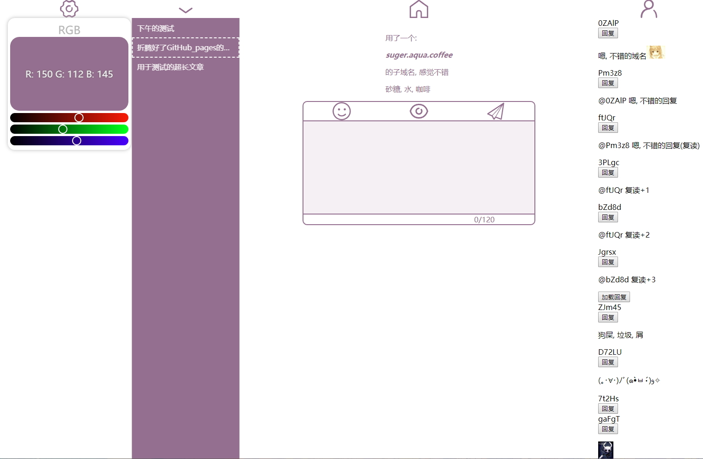

# 自建博客

目前进度的部分预览, 以下为welcome界面

一步步码, 进度随缘, 小瑕疵不少

TODO:

- [x] 文章上传编辑器
- [x] 主页
- [x] 文章获取
- [x] 评论上传与数据库存储
- [x] 评论获取与前端渲染
- [ ] 统一字体颜色
- [ ] 评论区的样式优化
- [ ] 只是为了评论有图而使用markdown编译图片不妥, 应该单独实现
- [ ] 统一资源的管理存放

BUGS:

- [x] 编辑器从indexDB恢复文章后没有改变输入区内容
- [x] 子评论添加表情时光标插入位置错误(错误地添加到了文章评论)
- [ ] 从编辑器恢复的文章上传到数据库保存时未解码, 一串乱七八糟的东西, 但前端渲染正常
- [ ] 各个元素板块的宽高问题很大, 内容被裁剪或空白过多
- [ ] 主页和welcome页的图片加载路径不统一
